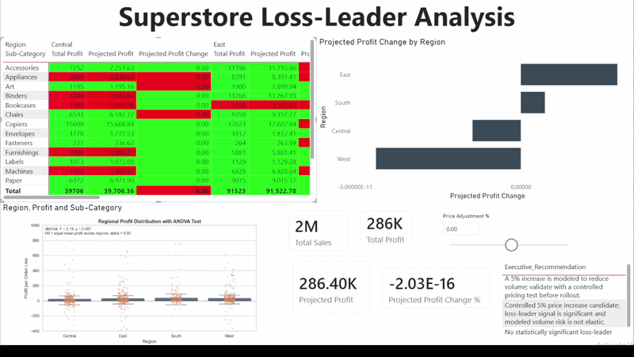

# Power BI Statistical Inference Dashboard: Superstore Loss-Leader Analysis



## Technologies

- Power BI
- DAX
- Python
- Pandas
- SciPy
- Seaborn
- Scikit-learn

## Project Overview

This project uses the Superstore Sales dataset to build an executive-facing Power BI dashboard that combines business intelligence with statistical inference.

The dashboard is designed to answer the question:

> Which product sub-categories are statistically significant loss-leaders, and how would a 5% price adjustment affect net profit across regions?

The project includes KPI cards, a regional profit matrix, a what-if price adjustment parameter, Python-based ANOVA testing, and price elasticity modeling by product sub-category.

## Dataset

This project uses the Superstore Sales dataset from Kaggle, found here: https://www.kaggle.com/datasets/vivek468/superstore-dataset-final

The dataset contains order-level sales records including:

- Sales
- Profit
- Discount
- Region
- Category
- Sub-Category
- Quantity

## Statistical Methods

### Loss-Leader Testing

Each product sub-category was tested to determine whether its average profit was significantly below zero.

A sub-category was classified as a statistically significant loss-leader when:

- Average profit was negative
- The statistical test showed evidence that losses were unlikely to be random noise

This allows the dashboard to distinguish between ordinary low-margin products and sub-categories that are consistently unprofitable.

### Price Elasticity Estimation

A Python script estimates price elasticity by sub-category using a log-log regression model.

The model estimates how demand changes when price changes:

```text
log(Quantity) ~ log(Estimated Unit Price)
```

The resulting elasticity values are exported to CSV and imported into Power BI.

These elasticity estimates are then used in DAX measures to simulate projected profit under different price adjustment scenarios.

## ANOVA Testing

The dashboard includes a Python visual that uses ANOVA to test whether average profit differs significantly across regions.

The visual shows:

- Regional profit distributions
- Individual order-line profit points
- ANOVA F-statistic
- ANOVA p-value

This adds statistical context to the regional profitability analysis.

## Key Findings

The analysis identified statistically significant loss-leader behavior in the dataset.

The dashboard highlights sub-categories where a 5% price adjustment may improve profitability, while also flagging products where higher prices may reduce volume too much.

Executive conclusion:

> Tables can safely increase 5%, while Furnishings may lose volume under the same adjustment.

These findings should be interpreted as pricing-test guidance, not final causal proof.

## Power BI Dashboard

### Executive Summary

Includes KPI cards for:

- Total Sales
- Total Profit
- Average Discount
- Projected Profit
- Projected Profit Change
- Projected Profit Change %

A price adjustment slicer allows users to simulate changes in pricing.

### Loss-Leader Analysis

Includes a matrix showing profit by:

- Region
- Sub-Category

Conditional formatting highlights profitable and unprofitable areas.

### Pricing Scenario

Shows how projected profit changes across regions and sub-categories when the price adjustment parameter is changed.

### Statistical Inference

Includes a Python visual with a seaborn boxplot and ANOVA test results for regional profit differences.
